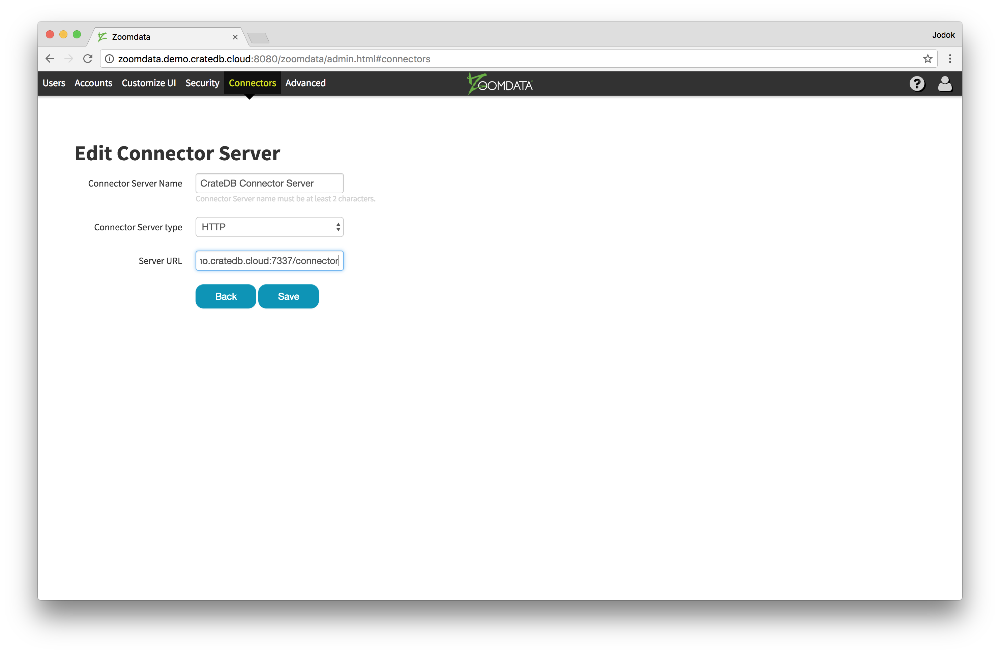

# Supported tags and respective `Dockerfile` links

- `latest`, `1`, `1.4`, `1.4.0` [(Dockerfile)](https://github.com/machine-data/docker-edc-cratedb/blob/master/Dockerfile)

# Zoomdata Connector Server for CrateDB on Docker

This repository holds a build definition and supporting files for building a Docker image to run [EDC-CrateDB](https://github.com/Zoomdata/edc-cratedb).
It is published as automated build `machinedata/edc-cratedb` on [Docker Hub](https://registry.hub.docker.com/u/machinedata/edc-cratedb/).

## What is the Zoomdata Connector Server for CrateDB?

[Zoomdata](https://www.zoomdata.com) is a next generation data visualization and analytics system optimized for real-time and historical big data backends.

The Connector Server for CrateDB allows Zoomdata to query a CrateDB Cluster.

## A clean, lightweight container

- Based on the official Alpine Linux image - super slim and lightweight.
- Only openjdk8-jre as dependency.
- No magic. Straight forward container that simply runs the JAR file.
- Image follows [Dockerfile best practices](https://docs.docker.com/engine/userguide/eng-image/dockerfile_best-practices/) (PID1 for proper signalling, logging,...)

## Quickstart

Simply start EDC-CrateDB and expose it via `http://{HOSTNAME}:7337`:

```sh
$ docker run -d -p 7337:7337 machinedata/edc-cratedb
```

## Configuring Zoomdata

Log in as supervisor and define the CrateDB Connector Server. It is using the HTTP protocol on port 7337 and connects to the /connector REST endpoint.



## Ports

- `7337`: The default port where EDC-CrateDB is listening. When specifying the connection string from Zoomdata make sure to use the `/connector` endpoint.

## Legal

EDC-CrateDB is a project of [Zoomdata, Inc.](https://www.zoomdata.com) under the [Apache 2.0 license](https://github.com/Zoomdata/edc-cratedb/blob/master/LICENSE) and was created by Quan Luu, Justin Boyd and William Bowen.

docker-edc-cratedb is licensed under the [Apache 2.0 license](https://github.com/machine-data/docker-edc-cratedb/blob/master/LICENSE).
Copyright 2017 [Crate.io, Inc.](https://crate.io).

## Contributing

Thanks for considering contributing to docker-edc-cratedb!
The easiest way to contribute is either by filing an [issue on Github](https://github.com/machine-data/docker-edc-cratedb/issues) or to [fork the repository](https://github.com/machine-data/docker-edc-cratedb/fork) to create a pull request.

If you have any questions don't hesitate to join us on Slack.
